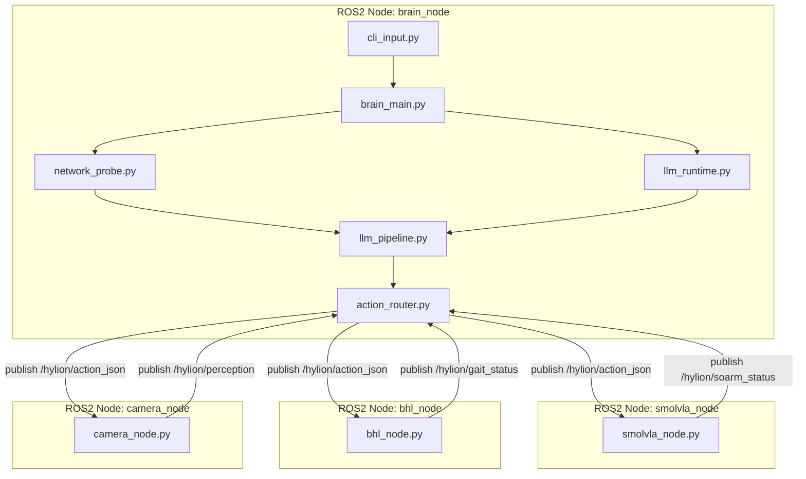

# 하이리온 Brain 아키텍처 및 토픽 연결 맵

> 상태 업데이트 (2026-04-21): 이 문서는 ROS2 기반 설계 참고용입니다.
> 
> 현재 기준의 활성 구현 계획과 체크리스트는 아래 문서를 사용합니다.
> - `docs/07_non_ros2_pipeline_master_plan.md`
> - `legacy/ros2/README.md`

기준: 2026-04-08
목적: 텍스트 입력부터 JSON 생성, 실행 노드 동작까지를 파일 단위로 명확히 정리

---

## 1. 설계 원칙 요약

- Brain은 결정만 수행: 입력 해석, JSON 생성, 답장 문구 생성
- Executor는 실행만 수행: SMOLVLA/BHL/카메라는 JSON 조건이 맞을 때만 동작
- 통신 계층 분리: 비즈니스 로직(Brain/Executor)과 전송 방식(ROS2/local bus) 분리
- 오프라인 안전 동작: 인터넷 미연결 시 JSON 실행명령 생성 대신 안내 메시지 우선

---

## 2. 권장 폴더 구조

```text
hylion_ws/
├── apps/
│   ├── brain/
│   │   ├── brain_main.py
│   │   ├── cli_input.py
│   │   ├── network_probe.py
│   │   ├── llm_runtime.py
│   │   ├── llm_pipeline.py
│   │   └── action_router.py
│   │
│   └── executors/
│       ├── smolvla/
│       │   └── smolvla_node.py
│       ├── bhl/
│       │   └── bhl_node.py
│       └── camera/
│           └── camera_node.py
│
├── shared/
│   ├── schemas/
│   │   └── action.schema.json
│   ├── contracts/
│   │   └── topic_contract.md
│   ├── config/
│   │   ├── settings.yaml
│   │   └── topics.yaml
│   └── utils/
│       ├── logging.py
│       ├── id_factory.py
│       └── time_utils.py
│
├── transport/
│   ├── ros2/
│   │   ├── ros2_publisher.py
│   │   └── ros2_subscriber.py
│   └── local/
│       └── local_queue_bus.py
│
├── scripts/
│   ├── run_brain.sh
│   ├── run_executors.sh
│   └── run_all_local.sh
│
├── tests/
│   ├── unit/
│   │   ├── test_network_probe.py
│   │   ├── test_llm_runtime.py
│   │   └── test_llm_pipeline.py
│   └── integration/
│       └── test_brain_to_executor_flow.py
│
└── docs/
    ├── architecture.md
    └── message_flow.md
```

---

## 3. 파일별 역할과 분류 이유

| 파일 | 역할 | 실행 시점 | 분류 이유 |
|---|---|---|---|
| apps/brain/brain_main.py | Brain 진입점, 입력 루프 실행 | 항상 | 오케스트레이션 중심 파일이므로 brain |
| apps/brain/cli_input.py | 터미널 텍스트 입력 수신 | 항상 | 사용자 입력 채널이 brain 책임 |
| apps/brain/network_probe.py | 인터넷 연결 확인 | 매 요청 전 | Groq 호출 전 조건 판단 로직 |
| apps/brain/llm_runtime.py | LLM 클라이언트/모델 1회 초기화 및 핸들 보관 | 부팅 시 1회 | 온라인 Groq + 오프라인 온디바이스 전환 대비 초기화 계층 |
| apps/brain/llm_pipeline.py | LLM 호출, 의도 정규화, reply_text 생성, 최종 JSON 조립 | 매 요청 | 요청 단위 비즈니스 로직을 한 파일로 통합 |
| apps/brain/action_router.py | JSON을 토픽으로 발행 | 온라인/오프라인 | 통신 계층 연결 경계 |
| apps/executors/smolvla/smolvla_node.py | pick_place 조건 판별 + 실행 | JSON 수신 시 | 단일 노드로 단순화 |
| apps/executors/bhl/bhl_node.py | gait 조건 판별 + 실행 | JSON 수신 시 | 단일 노드로 단순화 |
| apps/executors/camera/camera_node.py | 카메라 활성 조건 판별 + 캡처/제공 | JSON 수신 시 | 단일 노드로 단순화 |
| shared/schemas/action.schema.json | Action JSON 검증 스키마 | 빌드/런타임 | 노드 간 메시지 계약 표준 |
| shared/contracts/topic_contract.md | 토픽 방향/타입 명세 | 개발 전/중 | 팀 간 인터페이스 충돌 방지 |
| shared/config/topics.yaml | 토픽명 중앙 관리 | 부팅 시 | 하드코딩 제거 |
| transport/ros2/*.py | ROS2 pub/sub 실제 구현 | ROS2 모드 | 통신 기술 분리 |
| transport/local/local_queue_bus.py | 로컬 개발용 이벤트 버스 | 로컬 모드 | 빠른 단일 PC 테스트 |

---

## 4. 실행 흐름 (온라인/오프라인)

### 4.1 온라인

1. cli_input.py가 사용자 텍스트 수신
2. network_probe.py가 인터넷 연결 확인
3. llm_pipeline.py가 llm_runtime.py 핸들을 사용해 텍스트 분석 요청
4. llm_pipeline.py가 의도/객체 정규화 + reply_text 생성 + 최종 JSON 생성
7. action_router.py가 액션 토픽 발행
8. 각 executor 노드가 JSON을 수신하여 조건부 실행

### 4.2 오프라인

1. cli_input.py가 사용자 텍스트 수신
2. network_probe.py에서 offline 판정
3. llm_pipeline.py가 llm_runtime.py의 온디바이스 LLM(또는 fallback 규칙) 경로 실행
4. reply_text를 포함한 최소 JSON 생성 후 실행 명령은 안전 규칙에 따라 비활성

### 4.3 LLM 초기화/요청 처리 분리 기준

1. llm_runtime.py
- 앱 시작 시 1회 실행
- 온라인(Groq) 클라이언트와 오프라인(on-device) 엔진 로딩 담당
- 모델/클라이언트 핸들 반환

2. llm_pipeline.py
- 요청마다 실행
- llm_runtime.py에서 받은 핸들로 추론
- intent, reply_text, 실행 플래그를 한 번에 생성
- 최종 JSON 스키마로 정규화

---

## 5. 파일-토픽 연결 시각화

### 5.1 노드 내부 구성 + 노드 간 연결 다이어그램



### 5.2 노드 관점 해석

- brain_node 내부 파일: `brain_main.py`, `cli_input.py`, `network_probe.py`, `llm_runtime.py`, `llm_pipeline.py`, `action_router.py`
- smolvla_node 내부 파일: `smolvla_node.py`
- bhl_node 내부 파일: `bhl_node.py`
- camera_node 내부 파일: `camera_node.py`
- Brain은 `/hylion/action_json` 발행자, 나머지 3개 노드는 해당 토픽 구독자
- Camera/SmolVLA/BHL는 상태 토픽 발행자, Brain 라우터는 해당 토픽 구독자

### 5.3 발행/구독 표 (한눈에 보기)

| 파일 | 발행 토픽 | 구독 토픽 | 비고 |
|---|---|---|---|
| apps/brain/action_router.py | /hylion/action_json | /hylion/perception, /hylion/soarm_status, /hylion/gait_status | Brain 중심 라우터 |
| apps/executors/smolvla/smolvla_node.py | /hylion/soarm_status | /hylion/action_json | pick_place일 때만 동작 |
| apps/executors/bhl/bhl_node.py | /hylion/gait_status | /hylion/action_json | gait_cmd 존재 시 동작 |
| apps/executors/camera/camera_node.py | /hylion/perception | /hylion/action_json | 팔 노드 실행과 함께 활성 |

---

## 6. JSON 스키마 제안 (답장 포함)

핵심 목표: Brain이 발행하는 action JSON과 SO-ARM executor가 읽는 명령 기준을 하나로 맞춘다.

필수 규칙:
- `reply_text`는 항상 포함 (온라인/오프라인 공통)
- `reply_text`는 빈 문자열 금지 (TTS도 동일 텍스트 사용)
- 오프라인일 때도 사용자 안내 답장을 `reply_text`에 반드시 채움

```json
{
  "action_id": "string",
  "timestamp": "ISO8601",
  "session_id": "string",
  "source": "terminal|mic",
  "network_online": true,
  "intent": "chat|pick_place|move|stop|unknown",
  "target_object": "string",
  "reply_text": "string",
  "requires_smolvla": false,
  "requires_bhl": false,
  "gait_cmd": "walk_forward|turn_left|stop|none",
  "state_current": "IDLE|TALKING|MANIPULATING|WALKING|EMERGENCY",
  "safety_allowed": true,
  "fallback_policy": "precoded|smolvla|inverse_kinematics"
}
```

### 6.1 필수 항목(Required)

- `action_id`
- `timestamp`
- `session_id`
- `source`
- `network_online`
- `intent`
- `target_object`
- `reply_text`
- `requires_smolvla`
- `requires_bhl`
- `gait_cmd`
- `state_current`
- `safety_allowed`
- `fallback_policy`

---

## 7. 필드 설명 (운영 관점)

| 필드 | 의미 | 사용 주체 |
|---|---|---|
| action_id | 명령 추적 고유값 | 전 노드 |
| session_id | 세션 추적 값 | 전 노드 |
| network_online | 온라인/오프라인 판정 | Brain |
| intent | 상위 의도 | Executor 실행 판단 |
| target_object | 집기 대상 | SmolVLA |
| reply_text | 사용자에게 보여줄 답장 | UI/터미널 |
| requires_smolvla | 팔 노드 실행 여부 | SmolVLA 노드 |
| requires_bhl | 하체 노드 실행 여부 | BHL 노드 |
| gait_cmd | 보행 명령 | BHL 노드 |
| safety_allowed | 현재 실행 허용 여부 | 전 노드 |
| fallback_policy | 실패 시 대응 규칙 | Brain/Executor |

`reply_text` 운영 규칙:
- 온라인: `llm_pipeline.py`가 `llm_runtime.py`의 Groq 핸들로 intent와 `reply_text` 생성 (TTS는 동일 텍스트 사용)
- 오프라인: `llm_pipeline.py`가 `llm_runtime.py`의 온디바이스 경로(또는 fallback 템플릿)로 `reply_text` 생성
- 검증 실패: `action.schema.json` 기준으로 실패 처리 후 기본 안전 답장으로 교체

---

## 8. 구현 우선순위 (최소 동작 버전)

1. Brain 단독: 입력, 네트워크 체크, Groq 호출, JSON 출력
2. action.schema.json 단일 검증 연결 (reply_text 포함)
3. ROS2 토픽으로 action_json 발행
4. SmolVLA/BHL/Camera는 로그 기반 스텁 노드부터 연결
5. SmolVLA 수집 스키마(shared/schemas/smolvla_episode.schema.json) 연결
6. 이후 실제 제어 로직 탑재

---

## 9. 참고: 현재 파일과의 매핑

현재 워크스페이스의 파일을 점진적으로 아래와 같이 이동/통합 가능

- hylion_brain_v2.py -> apps/brain/brain_main.py
- brain_node.py -> apps/brain/action_router.py 또는 transport/ros2 쪽으로 분리
- perception_node.py, hylion_perception.py -> apps/executors/camera/
- soarm_node.py, hylion_soarm.py -> apps/executors/smolvla/

점진 마이그레이션 원칙:
- 파일명만 먼저 정리
- import 경로 수정
- 마지막에 토픽명 통일
