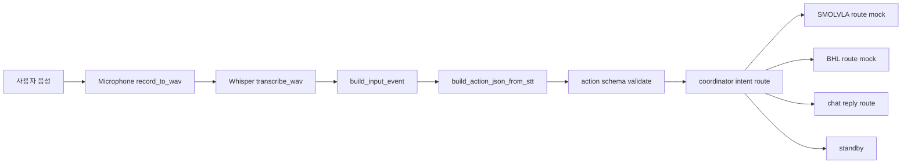
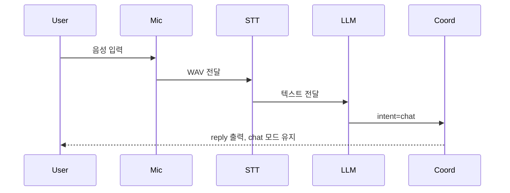

# HYlion Non-ROS2 Pipeline Master Plan

기준일: 2026-04-23  
상태: Active Plan (Phase 4 라이브 루프까지 반영)

---

## 1. 최종 구현 목표

### 1.1 무엇을 만들 것인가

Jetson 중심의 음성-지시 파이프라인을 ROS2 없이 구현한다.

- 사람 음성 입력(USB 마이크)
- Whisper 기반 STT (음성 -> 텍스트)
- LLM(Grok/Groq) 기반 의도 파싱 (텍스트 -> action JSON)
- Orchestrator가 JSON과 상태 이벤트를 받아 실행 분기
- 분기 결과
- `SmolVLA` 실행 (SO-ARM 조작)
- `BHL` 실행 (NUC 보행 제어)
- `답변만 출력` (TTS/텍스트)
- 향후 Emergency 신호(IMU/SO-ARM/BHL/Watchdog) 통합 가능한 구조 확보

### 1.2 전체 프로젝트 범위

이번 구현 범위(필수):

- Jetson 입력/판단 파이프라인
- Jetson <-> NUC 통신 계층
- SmolVLA/BHL 실행기 어댑터
- Orchestrator 상태 관리 및 분기
- 최소 테스트(단위 + 인터페이스 + 통합 mock)

이번 단계에서 구조만 반영(구현은 후순위):

- Emergency 실센서 연동 상세
- 고급 복구 정책(재시도, 회복 시나리오)

### 1.3 완성 결과물

완성 시 아래 결과물이 나온다.

- 음성 입력부터 실행기 호출까지 단일 파이프라인 동작
- JSON 계약 기반 오케스트레이션 동작
- ROS2 비의존 런타임
- 장애/오프라인 시 fallback 정책 동작
- 단계별 체크리스트가 반영된 문서 및 테스트 세트

---

## 2. 전체 블루프린트 (공통 원칙)

### 2.1 아키텍처 원칙

- 원칙 1: Business Logic와 Transport 분리
- 원칙 2: 모든 모듈은 JSON 계약으로 통신
- 원칙 3: Executor(SmolVLA/BHL/TTS)는 Orchestrator 명령만 수행
- 원칙 4: Emergency는 최우선 우선순위로 설계
- 원칙 5: 외부 의존(LLM/STT/네트워크) 실패 시 안전 fallback 제공

### 2.2 통신 방식 (ROS2 대체)

- Jetson 내부 모듈 간: Python in-process event bus (Queue 기반)
- Jetson <-> NUC: UDP 고정
- UDP 운영 규칙: `msg_type`, `seq`, `timestamp`, `session_id`를 포함한 JSON 패킷 사용
- 신뢰성 보강: 필수 명령(`stop`, `emergency`, `gait_cmd`)은 ACK + 재전송(타임아웃 기반) 적용
- 메시지 형식: UTF-8 JSON (버전 필드 포함)
- 로그 저장: JSONL (`data/episodes`, `logs/`) 방식

### 2.3 공통 데이터 계약

필수 계약 4종:

- `input_event`: mic/stt 결과 입력 이벤트
- `action_json`: LLM 결과/정규화 명령
- `executor_command`: orchestrator -> executor 전달 명령
- `emergency_event`: 각 모듈 -> orchestrator 안전 이벤트

권장 공통 필드:

- `event_id`, `timestamp`, `session_id`, `source`, `schema_version`

### 2.4 구현 원칙

- 함수는 단일 책임으로 분리
- I/O 경계(마이크, 네트워크, 모델)는 어댑터 레이어에서만 접근
- 모든 외부 호출은 timeout/retry/circuit breaker 정책 명시
- 스키마 검증 실패 시 즉시 safe fallback
- mock-first 개발: 하드웨어 없이 먼저 인터페이스 테스트 통과

### 2.5 코딩 규칙

- Python 3.10+ 타입 힌트 필수
- 파일/모듈명은 snake_case
- 설정은 `configs/*.yaml`에 두고 코드 하드코딩 금지
- 공통 enum/상수는 한 곳에서 정의
- 예외 처리 시 사용자 로그와 디버그 로그 분리

### 2.6 파일 저장/운영 규칙

- 런타임 로그: JSONL append-only
- 실험/세션 결과: `data/episodes/<session_id>/`
- 모델/체크포인트 경로는 상대경로 + config 기반
- 하드웨어 고유 값(장치 인덱스, IP)은 환경별 config로 분리

### 2.7 개발/실행 환경 원칙 (중요)

- 실제 런타임 환경은 Jetson/NUC의 Ubuntu 기반 환경이다.
- 코드 작성/수정은 Windows 노트북에서 진행할 수 있다.
- 개발 흐름은 `Windows 개발 -> GitHub push -> Jetson/NUC pull -> Ubuntu 실행/검증`을 기본으로 한다.
- 하드웨어 연관 기능(마이크, SO-ARM, BHL, UDP 실통신, emergency)은 반드시 Ubuntu 실환경에서 최종 검증한다.
- Windows 로컬 테스트는 빠른 개발용이며, 최종 통과 기준은 Ubuntu 실환경 테스트 결과를 따른다.

체크리스트 환경 라벨:

- `[DEV]`: Windows 개발 환경에서 수행
- `[TARGET]`: Jetson/NUC Ubuntu 실환경에서 수행
- `[DEV->TARGET]`: 개발 후 Ubuntu에서 반드시 재검증

---

## 3. Step-by-Step 체크리스트 (실행 가능한 상세 계획)

체크 규칙:

- `[ ]` 미완료
- `[x]` 완료
- 각 단계 완료 기준(DoD) 충족 시에만 체크

### Phase 0. ROS2 정리 및 기준선 고정

- [x] [DEV] ROS2 전용 `brain_node.py`를 legacy로 이동
- [x] [DEV] ROS2 의존 파일 목록 확정 (`action_router.py`, ROS2 관련 docs 포함)
- [x] [DEV] 비ROS2 런타임 경로를 기본 경로로 선언
- [x] [DEV] `README.md`에 비ROS2 기본 실행 흐름 반영

산출물:

- `legacy/ros2/brain_node.py`
- ROS2 deprecation inventory 문서

완료 기준:

- 신규 구현/실행 경로에서 ROS2 import가 필수가 아님

### Phase 1. 계약/스키마 정의

- [x] [DEV] `comm/protocol.py`에 메시지 타입 enum과 공통 헤더 정의
- [x] [DEV] `configs/schemas/action.schema.json` 점검 및 버전 필드 반영
- [x] [DEV] `input_event`, `executor_command`, `emergency_event` 스키마 초안 작성
- [x] [DEV] 스키마 검증 유틸 작성 (잘못된 payload 차단)

산출물:

- 공통 schema 4종
- 검증 유틸 + 샘플 payload

완료 기준:

- 잘못된 JSON 입력 시 orchestrator가 실행하지 않고 fallback 처리

### Phase 2. 마이크 + STT 파이프라인

- [x] [DEV->TARGET] `jetson/expression/microphone.py` 구현 (장치 선택, 녹음 세그먼트)
- [x] [DEV->TARGET] VAD/무음 구간 분리 정책 추가
- [x] [DEV->TARGET] Whisper 모듈 연동 (`faster-whisper` 권장)
- [x] [DEV->TARGET] STT 결과 표준 이벤트(`input_event`)로 변환

필요 장비/연결:

- Jetson + USB 마이크
- ALSA 장치 인식 확인

산출물:

- 음성 1문장 -> 텍스트 변환 데모 스크립트

완료 기준:

- 평균 2~3초 내 텍스트 전사
- 잡음 상황에서도 빈 결과 비율이 관리 가능한 수준
- Ubuntu 실환경(Jetson)에서 동일 기준 충족

### Phase 3. LLM JSON 생성 계층

- [x] [DEV->TARGET] `jetson/cloud/groq_client.py` 구현 (timeout/retry 포함)
- [x] [DEV->TARGET] STT 텍스트 -> action JSON 생성 함수 구현
- [x] [DEV->TARGET] JSON 정규화/검증 실패 fallback 구현
- [x] [DEV->TARGET] 오프라인/키 누락 시 로컬 규칙 기반 fallback 구현 (Cloud -> LocalLLM -> Offline 3단 fallback)

필요 장비/연결:

- Jetson 인터넷
- API key

산출물:

- 텍스트 입력별 action JSON 샘플 세트

완료 기준:

- chat/move/pick_place/stop 4개 의도 케이스 안정 분류
- Ubuntu 실환경(Jetson)에서 API 키/네트워크 조건 포함 동작 확인

### Phase 4. Orchestrator 코어

- [x] [DEV->TARGET] `jetson/core/coordinator.py` 구현 (실마이크 -> STT -> Groq 라이브 루프)
- [x] [DEV->TARGET] 분기 규칙 구현 (intent 기준 route)
- [x] [DEV->TARGET] `requires_smolvla=true` -> arm executor route 결정 (현재 mock route 출력)
- [x] [DEV->TARGET] `requires_bhl=true` -> bhl executor route 결정 (현재 mock route 출력)
- [x] [DEV->TARGET] chat -> reply/TTS only 경로 반영 (현재 reply 중심)
- [x] [DEV->TARGET] 실행 상태 전이(IDLE/TALKING/MANIPULATING/WALKING) 반영 + standby 복귀

산출물:

- 오케스트레이터 상태머신 + 분기 테스트

완료 기준:

- 동일 입력에서 결정적(deterministic) 분기 결과
- Ubuntu 실환경에서 executor 연동 시 동일 결과 유지

### Phase 5. 실행기 어댑터 구현

- [ ] [DEV->TARGET] `jetson/arm/policy/smolvla_runner.py` 구현
- [ ] [DEV->TARGET] `nuc/bhl/factory.py` 및 `comm/nuc/sender.py`, `comm/nuc/receiver.py` 구현
- [ ] [DEV->TARGET] UDP 송수신 규약 구현 (`seq`/ACK/재전송/중복 제거)
- [ ] [DEV->TARGET] TTS/speaker 어댑터와 orchestrator 연결
- [ ] [DEV->TARGET] executor 공통 인터페이스 정리 (`execute(command) -> status`)

필요 장비/연결:

- SO-ARM 연결
- Jetson <-> NUC 네트워크

산출물:

- executor adapter 계층

완료 기준:

- mock 환경/실환경 모두 동일 API로 호출 가능
- UDP 환경에서 패킷 유실/중복 상황에도 핵심 명령 전달 보장
- Jetson/NUC Ubuntu 실환경에서 장치 연동 검증 완료

### Phase 6. Emergency 구조 선반영

- [ ] [DEV->TARGET] `jetson/safety/emergency_stop.py` 기본 래치 구현
- [ ] [DEV->TARGET] emergency 이벤트 수신 채널 구현
- [ ] [DEV->TARGET] 우선순위 규칙(emergency > stop > task) 적용
- [ ] [DEV->TARGET] emergency 해제 전 executor 차단 정책 적용

산출물:

- EmergencyLatch + 정책 문서

완료 기준:

- emergency_event 주입 시 즉시 safe state 전환
- Jetson/NUC Ubuntu 실환경에서 emergency end-to-end 검증 완료

### Phase 7. 테스트/검증

- [ ] [DEV] 단위 테스트 작성 (파서/정규화/분기)
- [ ] [DEV->TARGET] 인터페이스 테스트 작성 (STT->LLM, LLM->orchestrator)
- [ ] [DEV->TARGET] 통합 mock 테스트 작성 (E2E)
- [ ] [DEV->TARGET] UDP 장애 테스트 작성 (유실/지연/중복/역순 도착)
- [ ] [TARGET] 실기기 smoke test 스크립트 작성

산출물:

- `tests/3_interface`, `tests/5_integration` 테스트 코드

완료 기준:

- 핵심 3경로 통과
- chat only
- pick_place -> smolvla
- move -> bhl
- 최종 pass 판정은 Jetson/NUC Ubuntu 실환경 기준

### Phase 8. 시스템 패키징/운영

- [ ] [DEV->TARGET] dev/prod config 분리 점검
- [ ] [TARGET] 실행 스크립트(systemd 또는 shell) 정리
- [ ] [DEV] 장애 대응 runbook 문서화
- [ ] [DEV->TARGET] 운영 로그 수집 포맷 확정

산출물:

- 운영 문서 + 실행 스크립트

완료 기준:

- 재부팅 후 자동 구동 가능한 수준
- Jetson/NUC Ubuntu에서 재부팅 후 자동 구동 검증 완료

---

## 4. 현재 진행 현황 스냅샷

- Phase 0: 완료
- Phase 1: 완료
- Phase 2: 완료
- Phase 3: 완료 (TARGET 검증 포함)
- Phase 4: 코어 루프 완료 (실 executor 연동은 Phase 5에서 진행)
- Phase 5~8: 미착수/부분 착수

현재 완료 항목:

- ROS2 전용 `brain_node.py` legacy 이관 완료
- ROS2 의존 파일 목록 확정 및 인벤토리 반영 완료
- Non-ROS2 기본 런타임 경로 선언 완료
- `README.md` Non-ROS2 실행 흐름 반영 완료
- `comm/protocol.py` 공통 메시지 헤더/타입 정의 완료
- `configs/schemas`에 input/executor/emergency 스키마 초안 추가 완료
- `comm/schema_validator.py` 검증 유틸 추가 완료
- `jetson/expression/microphone.py` 장치선택/녹음/VAD 구현 및 TARGET 검증 완료
- `jetson/expression/stt_whisper.py` Whisper 전사 및 `input_event` 변환 경로 구현/검증 완료
- `jetson/cloud/groq_client.py` 동적 스키마 프롬프트 로딩 + Cloud/Local/Offline fallback 구조 반영 완료
- STT 텍스트 -> action JSON 변환 테스트(`tests/3_interface/test_groq_api.py`) DEV/TARGET 검증 완료
- `configs/schemas/action.schema.json`에 `intent=standby`, `source=stt` 정렬 완료
- `jetson/core/coordinator.py` 라이브 루프(실마이크, Whisper, Groq, route 출력, auto-standby) 구현/Jetson 실주행 확인 완료
- 대화 종료 intent는 하드코딩 키워드가 아니라 LLM 분류로 standby 전환되도록 정리 완료

현재 경계 조건(아직 남은 부분):

- arm/bhl executor는 아직 실제 호출이 아닌 mock route 출력
- TTS speaker 실제 출력 경로는 미연결
- emergency 실신호 end-to-end 차단은 아직 미완료

---

## 5. Legacy 관리 규칙

- ROS2 전용 파일은 `legacy/ros2/`로 이동
- 문서에서 ROS2는 기본 경로가 아닌 참고/과거 이력으로 표기
- 새 구현 PR은 ROS2 의존 추가 금지

관련 문서:

- `legacy/ros2/README.md`

---

## 6. 전체 진행 흐름 (Step-by-Step, 쉬운 설명)

이 프로젝트는 아래 9단계 흐름으로 진행 중이다.

1. ROS2 경로 분리: 기존 ROS2 코드를 legacy로 이동해 새 런타임 충돌을 제거함
2. 데이터 계약 확정: 스키마(JSON 형식 약속) 4종을 먼저 고정함
3. 음성 입력 구현: 마이크 녹음 + VAD(무음/발화 구분)로 깨끗한 음성 구간 확보
4. STT 구현: Whisper로 음성을 텍스트로 변환
5. LLM 판단 구현: 텍스트를 action JSON으로 변환, 실패 시 fallback
6. 오케스트레이터 루프 구현: 반복적으로 듣고 판단하고 분기
7. 실행기 연동: arm/bhl/speaker를 실제 장치 호출로 연결 (현재 진행 예정)
8. 안전 계층 연동: emergency 신호가 오면 즉시 정지하도록 연결
9. 운영화: 재부팅 자동실행, 로그 수집, 장애 대응 문서화

---

## 7. 현재까지 구현된 것과 작동 원리

### 7.1 현재 구현 완료 범위

- 완료: Phase 0, 1, 2, 3
- 완료: Phase 4 코어 루프(실마이크 -> STT -> Groq -> intent 분기 -> auto-standby)
- 미완료: Phase 5 실 executor 실호출, Phase 6 emergency 실연동, Phase 8 운영 자동화

### 7.2 구조도 (현재 코드 기준)

### 7.3 신호/데이터가 지나가는 실제 함수 경로

1. 음성 녹음
	- `jetson/expression/microphone.py`
	- `record_to_wav()`가 장치를 선택하고 WAV 파일 생성

2. 음성 -> 텍스트
	- `jetson/expression/stt_whisper.py`
	- `transcribe_wav()`가 Whisper로 STT 수행

3. 입력 이벤트 생성
	- `jetson/expression/stt_whisper.py`
	- `build_input_event()`가 `input_event` JSON 생성

4. 텍스트 -> 액션 JSON
	- `jetson/cloud/groq_client.py`
	- `build_action_json_from_stt()` 실행
	- 내부에서 Cloud 실패 시 LocalLLM, 둘 다 실패 시 Offline fallback

5. 스키마 검증
	- `jetson/cloud/groq_client.py`
	- `_parse_and_validate_action_json()`에서 `action.schema.json` 기준 검증

6. 분기 실행
	- `jetson/core/coordinator.py`
	- `run_live_pipeline()` 루프에서 intent 확인
	- `_route_action()`이 현재는 executor route를 mock 출력

7. 작업 후 대기 복귀
	- `jetson/core/coordinator.py`
	- `_build_standby_action()`으로 자동 standby action 생성

### 7.4 동작 원리 핵심

- Orchestrator(오케스트레이터: 전체 흐름을 조정하는 중심 제어기)는 직접 하드웨어를 만지기보다, action JSON을 보고 "어디로 보낼지"를 결정한다.
- Schema(스키마: JSON 필드 규칙)가 맞지 않으면 즉시 fallback으로 내려가 안전한 unknown/IDLE 응답을 만든다.
- Fallback(폴백: 실패 시 안전하게 돌아가는 우회 경로)은 Cloud -> Local -> Offline 순서다.

---

## 8. 시나리오/상황별 동작 흐름

### 8.1 Chat 시나리오

결과:

- 루프를 끊지 않고 다음 발화를 계속 받음

### 8.2 Move 시나리오

1. STT 결과가 이동 명령으로 해석됨
2. action JSON에서 `intent=move`, `requires_bhl=true`
3. coordinator가 BHL route로 분기(mock)
4. 작업 후 자동 standby action 출력

### 8.3 Pick and Place 시나리오

1. STT 결과가 조작 명령으로 해석됨
2. action JSON에서 `intent=pick_place`, `requires_smolvla=true`
3. coordinator가 SMOLVLA route로 분기(mock)
4. 작업 후 자동 standby action 출력

### 8.4 Stop 시나리오

1. action JSON에서 `intent=stop`, `gait_cmd=stop`
2. coordinator가 BHL stop route로 분기(mock)
3. 즉시 대기 상태로 복귀

### 8.5 Conversation End(대화 종료) 시나리오

1. 사용자가 대화 마무리 의도를 말함
2. LLM이 `intent=standby` 반환
3. coordinator가 chat mode를 해제하고 standby 모드로 전환

### 8.6 장애 시나리오 (Cloud 실패)

1. Groq 호출 실패 또는 스키마 불일치
2. LocalLLM 시도
3. Local도 실패하면 Offline fallback JSON 생성
4. `intent=unknown`, `state_current=IDLE`로 안전 대기

---

## 9. 지금부터 해야 할 일 (더 잘게 쪼갠 Step-by-Step)

### Step 1. Phase 5-1: executor 인터페이스 먼저 고정

1. `execute(command) -> status` 공통 인터페이스를 arm/bhl/speaker에 동일하게 맞춤
2. mock executor와 real executor를 같은 호출 시그니처로 통일
3. coordinator의 `_route_action()`에서 print가 아니라 인터페이스 호출로 치환

완료 기준:

- intent마다 실제 함수 호출이 발생하고 status가 반환됨

### Step 2. Phase 5-2: SMOLVLA arm 실연동

1. `jetson/arm/policy/smolvla_runner.py`에 실행 래퍼 구현
2. pick_place 입력 시 arm 실행 커맨드 생성
3. 성공/실패 status와 에러 로그 규격화

완료 기준:

- pick_place에서 mock 출력이 아니라 실제 arm runner 함수가 호출됨

### Step 3. Phase 5-3: BHL + UDP 실연동

1. `comm/nuc/sender.py`, `comm/nuc/receiver.py`에 seq/ACK/재전송 적용
2. move/stop intent를 executor_command로 변환
3. NUC 수신 측에서 중복 제거와 ACK 반환

완료 기준:

- 패킷 유실 상황에서도 stop 명령 전달 보장

### Step 4. Phase 5-4: chat reply -> speaker(TTS) 연결

1. reply_text를 speaker 어댑터로 전달
2. chat intent에서는 모션 executor를 건드리지 않도록 보호
3. 음성 출력 실패 시 텍스트 fallback 로그 유지

완료 기준:

- chat 입력에서 실제 음성 출력까지 동작

### Step 5. Phase 6: emergency 우선 차단

1. emergency latch(래치: 한 번 걸리면 해제 전까지 유지되는 안전 잠금) 구현
2. emergency_event 수신 시 모든 executor 호출 차단
3. 해제 전에는 어떤 intent도 실행 불가

완료 기준:

- emergency 주입 테스트에서 즉시 safe state 전환

### Step 6. Phase 7: 테스트 체계 정리

1. 인터페이스 테스트를 coordinator 분기까지 확장
2. 통합 mock 테스트로 chat/move/pick_place/stop/standby 5경로 고정
3. TARGET smoke test 스크립트 자동화

완료 기준:

- DEV + TARGET 모두에서 핵심 시나리오 재현 가능

### Step 7. Phase 8: 운영화

1. 실행 스크립트/systemd 정리
2. 장애 대응 runbook 문서화
3. 로그 포맷(JSONL)와 저장 위치 확정

완료 기준:

- 재부팅 후 자동 구동 + 장애 대응 절차 문서 확보

---

## 10. 현재 시점 한 줄 정리

지금은 "음성 입력 -> STT -> LLM 의도판단 -> 오케스트레이터 분기"까지는 실기기에서 돌아가며, 다음 핵심은 "분기 결과를 실제 arm/bhl/speaker에 연결"하는 단계다.
