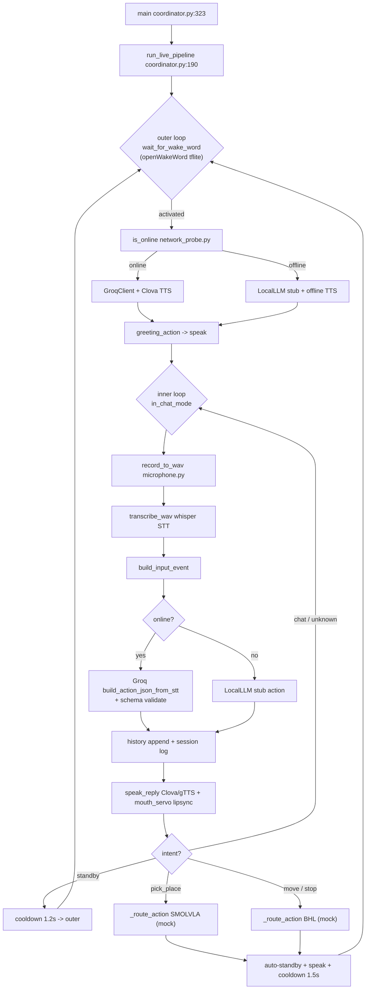

# Hylion 프로젝트 전체 흐름 & 구조

기준 시점: 2026-05-05
기준 브랜치: `e1`
주 진입점: [jetson/core/coordinator.py](../jetson/core/coordinator.py)

---

## 1. 전체 진입점 (Entry Points)

| 진입점 | 위치 | 상태 | 용도 |
|---|---|---|---|
| **표준 런타임** | [jetson/core/coordinator.py](../jetson/core/coordinator.py) | 동작 중 | Wake → STT → LLM → TTS 라이브 루프 |
| 임시 Brain 루프 | [jetson/core/brain/brain_main.py](../jetson/core/brain/brain_main.py) | 레거시(ROS2 의존) | CLI 입력 → LLM → ROS2 publish |
| Brain v2 (레거시) | [jetson/core/hylion_brain_v2.py](../jetson/core/hylion_brain_v2.py) | 미사용 | 카메라+LLM 실험 코드 |

---

## 2. 메인 런타임 흐름도 (`coordinator.py`)

```
┌─────────────────────────────────────────────────────────────────────────┐
│                         main()  [coordinator.py:323]                    │
│   args 파싱 → wake_word listener 빌드 → whisper warm_up → run_live_pipeline
└─────────────────────────────────────────────────────────────────────────┘
                                    │
                                    ▼
┌─────────────────────────────────────────────────────────────────────────┐
│                run_live_pipeline()  [coordinator.py:190]                │
│   session_id 생성 · history=[] · MouthServoController(pin=33) 초기화    │
└─────────────────────────────────────────────────────────────────────────┘
                                    │
                                    ▼
        ╔═══════════════════════════════════════════════════════╗
        ║           [outer loop] 웨이크워드 대기 모드            ║
        ╠═══════════════════════════════════════════════════════╣
        ║  wakeword_listener.wait_for_wake_word()               ║
        ║  └─ jetson/expression/wake_word.py                     ║
        ║     openWakeWord(tflite) @ 16kHz 다운샘플              ║
        ║     모델: checkpoints/wakeword/Hey_Hyleon.tflite       ║
        ╚═══════════════════════════════════════════════════════╝
                                    │ 활성화
                                    ▼
        ┌──────────────────────────────────────────────┐
        │  is_online()  [brain/network_probe.py]        │
        │  → 8.8.8.8:53 / 1.1.1.1:53 / google / naver  │
        └──────────────────────────────────────────────┘
                                    │
                ┌───────────────────┴───────────────────┐
                ▼ online                                ▼ offline
   _build_turn_services(True)                  _build_turn_services(False)
   ├ GroqClient() + 연결 점검 probe            ├ LocalLLM()  ※스텁
   └ build_tts_backend(clova)                  └ build_tts_backend(offline)
                │                                      │
                └──────────────────┬───────────────────┘
                                   ▼
        ┌───────────────────────────────────────────────────┐
        │  greeting_action 생성 → ACTION_JSON(GREETING)      │
        │  _speak_reply_if_any("네, 말씀하세요!")            │
        │  in_chat_mode = True                               │
        └───────────────────────────────────────────────────┘
                                   │
                                   ▼
   ╔══════════════════════════════════════════════════════════╗
   ║       [inner loop] 채팅 모드 - 웨이크워드 없이 반복      ║
   ╠══════════════════════════════════════════════════════════╣
   ║                                                          ║
   ║  ① record_to_wav()                                       ║
   ║     [jetson/expression/microphone.py:109]                ║
   ║     USB 마이크 → data/episodes/live_YYYYMMDD_HHMMSS.wav  ║
   ║                                                          ║
   ║  ② transcribe_wav() → STTResult(text, lang)              ║
   ║     [jetson/expression/stt_whisper.py:71]                ║
   ║     openai-whisper (cuda → cpu fallback), small/ko       ║
   ║                                                          ║
   ║  ③ build_input_event() → INPUT_JSON 출력                  ║
   ║                                                          ║
   ║  ④ 액션JSON 생성 (online 분기)                            ║
   ║     ┌─ online  ─→ build_action_json_from_stt()           ║
   ║     │            [jetson/cloud/groq_client.py:226]       ║
   ║     │            Groq llama-3.1-8b-instant + JSON mode   ║
   ║     │            schema: configs/schemas/action.schema.json
   ║     │            → 실패 시 LocalLLMClient → 실패 시 stub  ║
   ║     └─ offline ─→ LocalLLM().build_action_json_from_stt()║
   ║                                                          ║
   ║  ⑤ history.append(user/assistant)  최근 10턴 유지         ║
   ║  ⑥ _append_session_log() → data/sessions/<id>.jsonl       ║
   ║                                                          ║
   ║  ⑦ _speak_reply_if_any(stage="before_<intent>")           ║
   ║     [jetson/expression/speaker.py:428]                   ║
   ║     ├─ Clova Premium TTS (HTTP)  ─→ mp3                  ║
   ║     ├─ gTTS fallback                                     ║
   ║     ├─ mpg123 재생 (PULSE_SINK = USB)                    ║
   ║     └─ MouthServoController.run_lipsync_for_duration()   ║
   ║        [jetson/expression/mouth_servo.py:89]             ║
   ║        Jetson.GPIO Pin33 software-PWM 50Hz               ║
   ║                                                          ║
   ║  ⑧ intent 분기  ─────────────────────────────────────────╗║
   ║     │                                                    ║║
   ║     ├ chat / unknown → continue (다시 ①로)               ║║
   ║     │                                                    ║║
   ║     ├ standby       → CHAT_STANDBY_COOLDOWN(1.2s)        ║║
   ║     │                 in_chat_mode=False → outer 복귀    ║║
   ║     │                                                    ║║
   ║     └ pick_place / move / stop                           ║║
   ║       └ _route_action()                                  ║║
   ║         ├ pick_place → "[Executor] SMOLVLA route" (mock) ║║
   ║         ├ move/stop  → "[Executor] BHL route"    (mock) ║║
   ║         └ chat       → "[Executor] reply/TTS"            ║║
   ║         그 후 standby_action 생성 + speak                ║║
   ║         AUTO_STANDBY_COOLDOWN(1.5s) → outer 복귀         ║║
   ╚══════════════════════════════════════════════════════════╝
                                   │
                              KeyboardInterrupt
                                   ▼
                      cleanup: wakeword.close() · cleanup_gpio()
```

---

## 3. 모듈별 파일 구조 + 동작 상태

```
Hylion/
├─ jetson/                                      ◀ 현재 런타임이 도는 곳
│  ├─ core/
│  │  ├─ coordinator.py            ✅ 메인 진입점 (라이브 루프)
│  │  ├─ hylion_brain_v2.py        ⚠ 레거시 (camera+LLM 실험, 미연결)
│  │  └─ brain/                    ⚠ ROS2 의존 레거시 경로
│  │     ├─ brain_main.py          → CLI 루프
│  │     ├─ llm_pipeline.py        → build_action_json (정규화/오프라인 fallback)
│  │     ├─ action_router.py       → ROS2 /hylion/action_json 퍼블리셔
│  │     ├─ llm_runtime.py         → Groq/offline 핸들 초기화
│  │     ├─ network_probe.py       ✅ coordinator 가 import 해서 사용
│  │     └─ cli_input.py           (거의 빈 파일)
│  │
│  ├─ cloud/
│  │  └─ groq_client.py            ✅ Groq REST + LocalLLMClient stub
│  │     ├─ build_system_prompt() (action.schema 주입)
│  │     ├─ _parse_and_validate_action_json
│  │     ├─ _apply_conversation_policy (standby 강제 정규화)
│  │     └─ build_action_json_from_stt()  ← coordinator 호출
│  │
│  ├─ expression/                  ◀ 음성 IO 전부
│  │  ├─ wake_word.py              ✅ openWakeWord (tflite, 16kHz 리샘플)
│  │  ├─ microphone.py             ✅ sounddevice 녹음 + VAD 유틸
│  │  ├─ stt_whisper.py            ✅ openai-whisper (CUDA→CPU fallback)
│  │  ├─ speaker.py                ✅ Clova/gTTS + mpg123 + lipsync 스레드
│  │  ├─ mouth_servo.py            ✅ Jetson.GPIO Pin33 SW-PWM
│  │  ├─ mock_mouth_servo.py       (테스트용)
│  │  └─ factory.py                Speaker/MockSpeaker 선택
│  │
│  ├─ perception/                  ❌ 전부 빈 파일 (스텁)
│  │  ├─ camera.py / mock_camera.py
│  │  ├─ imu.py     / mock_imu.py
│  │  ├─ mediapipe_tracker.py
│  │  └─ factory.py
│  │
│  ├─ arm/                         ❌ 전부 빈 파일 (스텁)
│  │  ├─ so_arm.py / mock_arm.py / factory.py
│  │  └─ policy/
│  │     ├─ smolvla_runner.py
│  │     └─ async_inference.py
│  │
│  ├─ state_machine/fsm.py         ❌ 빈 파일
│  ├─ safety/                      ❌ 전부 빈 파일
│  │  ├─ emergency_stop.py · watchdog.py · fault_detector.py
│  └─ scenarios/                   ❌ 빈 파일
│     ├─ base_scenario.py · serve_cup.py
│
├─ nuc/bhl/                        ❌ 빈 파일 (BHL 보행 측 스텁)
│  ├─ factory.py · mock_biped.py
│
├─ comm/                           ◀ Jetson↔NUC 메시지 계약
│  ├─ protocol.py                  ✅ MessageType, MessageHeader, ACK
│  ├─ schema_validator.py          ✅ jsonschema 검증
│  ├─ mock_bridge.py               ❌ 빈 파일
│  ├─ nuc/{sender,receiver}.py     ❌ 빈 파일 (UDP 미구현)
│  └─ orin/{sender,receiver}.py    ❌ 빈 파일
│
├─ configs/
│  ├─ dev.yaml · prod.yaml · policy_latest.yaml
│  └─ schemas/                     ◀ 모든 메시지의 진실 소스
│     ├─ action.schema.json        ← LLM 프롬프트에 주입됨
│     ├─ input_event.schema.json
│     ├─ executor_command.schema.json
│     ├─ emergency_event.schema.json
│     └─ smolvla_episode/session.schema.json
│
├─ checkpoints/wakeword/
│  └─ Hey_Hyleon.tflite            ◀ 웨이크워드 모델 가중치
│
├─ data/
│  ├─ episodes/                    ◀ 라이브 녹음 wav (gitignore)
│  ├─ reply/                       ◀ TTS mp3 출력
│  └─ sessions/                    ◀ 턴 단위 jsonl 로그
│
├─ legacy/ros2/                    ◀ ROS2 노드 보존(미사용)
├─ sim/                            ◀ MuJoCo / IsaacLab 학습 측
├─ tests/                          ◀ unit/interface/integration
└─ docs/                           ◀ 기획서·SW 계획·시나리오
```

---

## 4. 데이터 흐름 (입력 → 출력 한 줄 요약)

```
USB Mic ──► wake_word(tflite) ──► record_to_wav ──► whisper(STT)
                                                        │
                                                        ▼
                                              build_input_event
                                                        │
                              ┌─────────────────────────┴─────────────────────────┐
                              │ online: GroqClient + action.schema → ACTION_JSON  │
                              │ offline: LocalLLM stub → ACTION_JSON (fallback)   │
                              └─────────────────────────┬─────────────────────────┘
                                                        ▼
                                              intent 분기 (chat / standby /
                                              pick_place / move / stop / unknown)
                                                        │
                                ┌───────────────────────┼───────────────────────┐
                                ▼                       ▼                       ▼
                         Speaker(Clova/gTTS)    _route_action()          history+session log
                         + mpg123 재생          (현재는 print만,           data/sessions/*.jsonl
                         + MouthServo lipsync   SMOLVLA/BHL 미연결)
```

---

## 5. Mermaid 흐름도 (렌더링용)



---

## 6. 한눈 요약

- **실제로 살아있는 라인**: `coordinator.py` → `wake_word` → `microphone` → `stt_whisper` → `groq_client` → `speaker` + `mouth_servo`. 이 7개 파일이 파이프라인 전부.
- **계약 레이어**: [configs/schemas/action.schema.json](../configs/schemas/action.schema.json) 가 LLM 프롬프트와 검증 양쪽에 쓰여 단일 진실 소스 역할.
- **스텁만 있는 영역**: `perception/*`, `arm/*`, `safety/*`, `scenarios/*`, `state_machine/fsm.py`, `nuc/bhl/*`, `comm/{nuc,orin}/*`, `comm/mock_bridge.py`. → SMOLVLA/BHL/세이프티/UDP 브리지가 통째로 미구현.
- **레거시**: `core/brain/*`(ROS2 publish 경로), `core/hylion_brain_v2.py`, `legacy/ros2/`. README는 ROS2 의존을 더 이상 추가하지 않는다고 명시.
