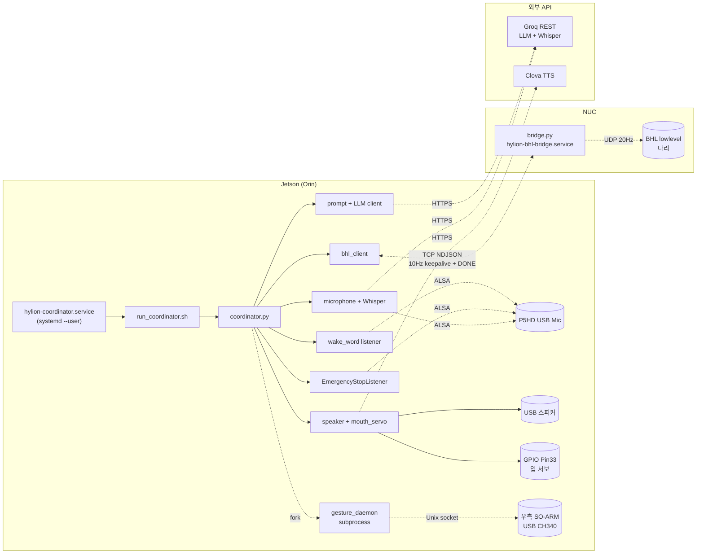
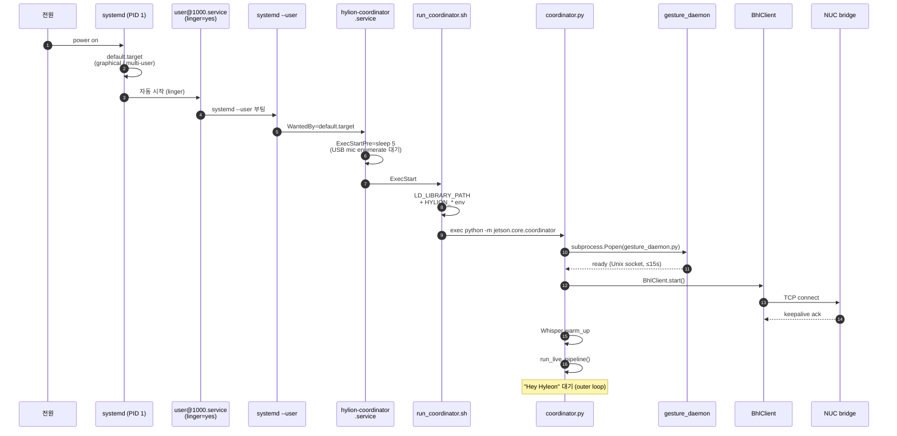
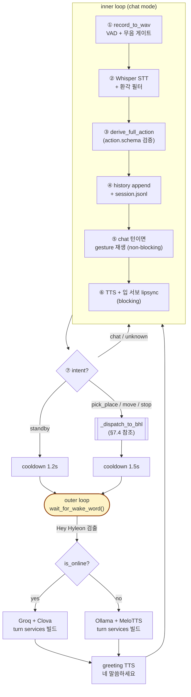
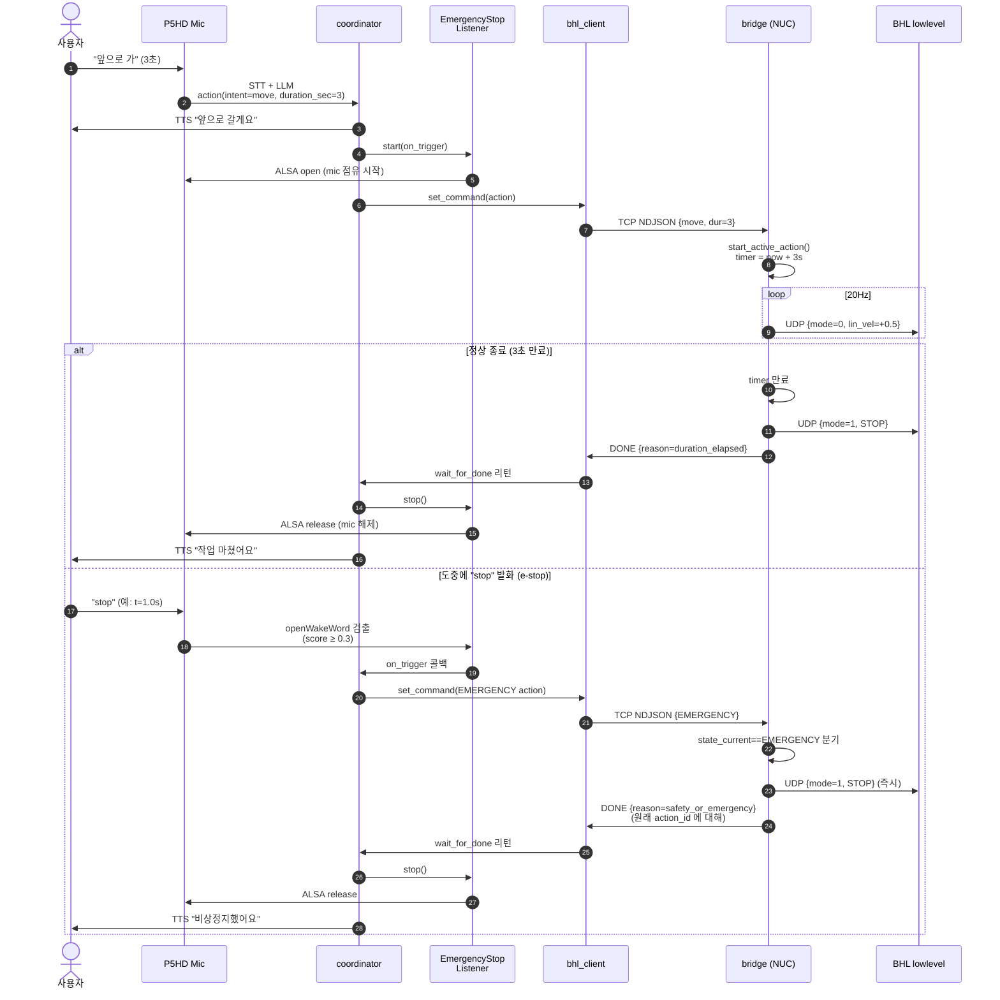

# Hylion 프로젝트 전체 흐름 & 구조

기준 시점: 2026-05-20
기준 브랜치: `e1`
주 진입점: [scripts/run_coordinator.sh](../scripts/run_coordinator.sh) →
[jetson/core/coordinator.py](../jetson/core/coordinator.py)

운영 모델: 부팅 시 자동 실행하지 않는다. 사람이 SSH 로 들어와
[scripts/preflight.sh](../scripts/preflight.sh) 로 환경을 점검한 뒤
`run_coordinator.sh` 로 작동을 시작한다 (§1·§5). 무인 배치용 systemd 자동
실행은 옵션으로만 남겨둠 (§5).

---

## 0. 한눈에 보는 시스템 토폴로지

```
┌─────────────────────────── Jetson (Orin) ──────────────────────────────┐
│                                                                        │
│  systemd --user                                                        │
│   └─ hylion-coordinator.service  (B 서비스 · 옵션, §5 참고)            │
│        └─ scripts/run_coordinator.sh                                   │
│             └─ python -m jetson.core.coordinator                       │
│                  ├─ wake_word listener  ("Hey Hyleon" tflite)          │
│                  ├─ EmergencyStopListener  ("stop" tflite, 동작중에만) │
│                  ├─ microphone (record/VAD) → STT (Whisper)            │
│                  ├─ LLM (Groq online ↔ Ollama offline)                 │
│                  ├─ TTS (Clova online ↔ MeloTTS offline) + 입 서보     │
│                  ├─ BhlClient ──TCP/NDJSON──▶ NUC bridge               │
│                  └─ subprocess: gesture_daemon (~/smolvla 별도 venv)   │
│                                  └─ Unix socket: 우측 SO-ARM 제어      │
│                                                                        │
│  하드웨어:  P5HD USB 마이크, USB 스피커, Jetson.GPIO Pin33 (입 서보)   │
│            우측 SO-ARM (USB CH340 시리얼)                              │
└────────────────────────────────────────────────────────────────────────┘
                                    │
                                    │  TCP/NDJSON  (HYLION_BHL_HOST:PORT)
                                    │  10Hz keepalive + 단발 명령 + DONE
                                    ▼
┌──────────────────────────── NUC (BHL) ─────────────────────────────────┐
│  systemd: hylion-bhl-bridge.service                                    │
│   └─ python -m nuc.bhl.bridge                                          │
│        ├─ Jetson TCP listener (NDJSON)                                 │
│        ├─ duration_sec 타이머 → 만료 시 STOP + DONE 회신               │
│        └─ UDP ──▶ BHL lowlevel (mode/lin_vel/ang_vel)  20Hz            │
└────────────────────────────────────────────────────────────────────────┘
                                    │
                                    │  UDP, BHL packet
                                    ▼
                       ┌────────────────────────────┐
                       │ BHL lowlevel (다리 제어)   │
                       │ Berkeley-Humanoid-Lite     │
                       └────────────────────────────┘

(외부 클라우드)
   Groq API ──◀─── coordinator(online LLM)
   Clova TTS ─◀─── speaker (online TTS)
```

---

## 1. 라이프사이클 — 환경 점검 → 작동 시작 → 정지

평소 운영은 부팅 자동 실행이 아니다. 사람이 SSH 로 들어와 점검하고 작동을
시작한다. (무인 배치용 자동 실행 옵션은 §5.)

```
[전원 ON]
    │
    ▼
systemd 부팅 → graphical.target 또는 multi-user.target
    │
    ▼
로그인 프롬프트에서 대기 — 코디네이터는 아직 안 뜸
    │
    │   ◀── 노트북에서 SSH 접속:  ssh <user>@<jetson-ip> ; cd ~/Hylion
    ▼
┌─ 1단계: 환경 설정 / 점검 ───────────────────────────────┐
│  bash scripts/preflight.sh                              │
│    venv · libcusparseLt · wake-word 모델                │
│    P5HD 마이크 · 스피커 · NUC bridge TCP                 │
│    Ollama · MeloTTS · gesture venv · SO-ARM             │
│    네트워크 · API 키 · 서비스 충돌                       │
│    → [ OK ]/[WARN]/[FAIL] 요약, FAIL 있으면 exit 1      │
│  bash scripts/test_wakeword.sh ...   (간단 기능 테스트)  │
└─────────────────────────────────────────────────────────┘
    │  점검 통과 (FAIL 0 개) 확인
    ▼
┌─ 2단계: 작동 시작 ──────────────────────────────────────┐
│  bash scripts/run_coordinator.sh                        │
│    ├─ LD_LIBRARY_PATH = libcusparseLt 포함              │
│    ├─ env: HYLION_WAKEWORD_DEVICE_KEYWORD=P5HD           │
│    ├─ env: HYLION_BHL_HOST / _PORT                      │
│    └─ exec python -m jetson.core.coordinator            │
└─────────────────────────────────────────────────────────┘
    │
    ▼
coordinator.main()
    ├─ gesture_daemon subprocess fork (15s 대기)
    ├─ BhlClient.start() (NUC bridge TCP 연결, keepalive)
    ├─ wake_word listener 빌드
    ├─ Whisper warm_up
    └─ run_live_pipeline()
    │
    ▼
(메인 루프: §2)
    │
    ▼
Ctrl+C (KeyboardInterrupt)
    ├─ wake_word.close()
    ├─ bhl_client.stop()
    ├─ gesture_daemon.stop() (Unix socket 종료 신호)
    └─ cleanup_gpio()
```

---

## 2. 메인 런타임 흐름 (turn-based)

```
        ╔═══════════════════════════════════════════════════════╗
        ║          [outer loop] 웨이크워드 대기                  ║
        ╠═══════════════════════════════════════════════════════╣
        ║  wakeword_listener.wait_for_wake_word()                ║
        ║  └─ openWakeWord(tflite) @ 16kHz                       ║
        ║     모델: checkpoints/wakeword/Hey_Hyleon.tflite       ║
        ╚═══════════════════════════════════════════════════════╝
                                │ "Hey Hyleon"
                                ▼
                ┌──────────────────────────┐
                │  is_online() probe       │ → online / offline 분기
                └──────────────────────────┘
                                │
                ┌───────────────┴───────────────┐
                ▼ online                        ▼ offline
        Groq llama-3.1-8b              Ollama qwen2.5:1.5b
        Clova Premium TTS              MeloTTS (로컬 daemon)
                │                              │
                └──────────────┬───────────────┘
                               ▼
                "네, 말씀하세요!" greeting (TTS+lipsync)
                               │
                               ▼
   ╔══════════════════════════════════════════════════════════╗
   ║         [inner loop] 채팅 모드 - wake 없이 반복           ║
   ╠══════════════════════════════════════════════════════════╣
   ║  ① record_to_wav() (microphone.py)                       ║
   ║     - VAD 무음 게이트 + Whisper 환각 필터                ║
   ║                                                          ║
   ║  ② transcribe_wav() (stt_whisper / groq_whisper)         ║
   ║                                                          ║
   ║  ③ build_action_json_from_stt()                          ║
   ║     - prompt.py: extract_core / apply_hard_overrides /   ║
   ║       derive_full_action / assemble_action               ║
   ║     - online: Groq REST + JSON mode                      ║
   ║     - offline: Ollama qwen + 동일 derive 레이어          ║
   ║     - 둘 다 action.schema.json 으로 검증                 ║
   ║                                                          ║
   ║  ④ history append (최근 10턴) + session jsonl 로그       ║
   ║                                                          ║
   ║  ⑤ _start_gesture_if_any() ← chat 턴만, non-blocking     ║
   ║     요청 스레드에서 gesture_daemon.play(name) ACK 대기   ║
   ║     coordinator 는 즉시 다음 단계(TTS)로 진행            ║
   ║     실패해도 대화 루프 안 끊김                           ║
   ║                                                          ║
   ║  ⑥ _speak_reply_if_any() TTS + 입 서보 lipsync (blocking)║
   ║                                                          ║
   ║  ⑦ intent 분기 ─────────────────────────────────────────╗║
   ║     │                                                   ║║
   ║     ├ chat / unknown      → ①로 (다음 발화 대기)         ║║
   ║     │                                                   ║║
   ║     ├ standby             → cooldown 1.2s → outer 복귀  ║║
   ║     │                                                   ║║
   ║     └ pick_place / move / stop                          ║║
   ║       └ _dispatch_to_bhl()                              ║║
   ║         ├─ EmergencyStopListener.start() (mic 점유 시작)║║
   ║         ├─ bhl_client.set_command(action_json)          ║║
   ║         │     → NUC bridge 로 TCP 송신                  ║║
   ║         │     → bridge 가 UDP 로 BHL lowlevel 송출      ║║
   ║         │     → duration_sec 타이머 시작                ║║
   ║         ├─ bhl_client.wait_for_done(timeout)            ║║
   ║         │     ◀ DONE 수신 (duration_elapsed /           ║║
   ║         │       stop_command / safety_or_emergency)     ║║
   ║         ├─ EmergencyStopListener.stop() (mic 해제)      ║║
   ║         └─ bhl_client.clear()                           ║║
   ║                                                         ║║
   ║         ├ done.reason=safety_or_emergency 면            ║║
   ║         │  standby reply 를 "비상정지했어요…" 로 교체    ║║
   ║         │                                                ║║
   ║         └ standby 액션 생성 + TTS + cooldown 1.5s →     ║║
   ║           outer 복귀                                    ║║
   ╚══════════════════════════════════════════════════════════╝
                                │
                          KeyboardInterrupt / stop signal
                                ▼
                       (cleanup, §1 참조)
```

### E-stop 흐름 (위 ⑦ 의 BHL 분기 안에서만 동작)

```
move 실행 시작:  EmergencyStopListener.start(on_trigger=push_emergency_action)
                                │
                                ▼ ("stop" 발화 검출)
            on_trigger 콜백:
              bhl_client.set_command(EMERGENCY action)
                                │
                                ▼
            bridge 가 map_json_to_packet 에서 state_current==EMERGENCY 보고
              ├─ STOP UDP 즉시 송신
              └─ 원래 action_id 에 대한 DONE(reason=safety_or_emergency) 회신
                                │
                                ▼
            coordinator wait_for_done 풀림
              → listener.stop() (mic 해제)
              → reason 전파 → reply 교체
```

**안전 원칙**: mic 점유는 정확히 BHL 동작 구간에만 (record/main wake listener 와
ALSA single-open 충돌 회피). threshold 0.3~0.4 (false negative 가 false positive
보다 위험하므로 살짝 민감하게). 모델/오디오 미가용이면 listener 가 disabled 상태로
빌드되고 dispatch 가 자동 우회.

---

## 3. 모듈/파일 인벤토리 (2026-05-18 기준)

범례: ✅ 동작 중 · ⚠ 부분 동작 · ❌ 빈 파일/스텁 · 📦 외부 시스템

```
Hylion/
├─ scripts/                              ◀ 운영 진입점/관리 스크립트
│  ├─ preflight.sh                       ✅ 1단계: 환경 점검 (코디 안 띄움)
│  ├─ run_coordinator.sh                 ✅ 2단계: 작동 시작 런처 (venv+env+exec)
│  ├─ test_wakeword.sh / .py             ✅ 마이크+wakeword 격리 테스트
│  ├─ live_monitor.sh                    ✅ RAM/GPU/프로세스 모니터 (1s)
│  ├─ install-coordinator-service.sh     ⚠ 옵션 B: 자동 실행 설치/제거 (무인 배치)
│  ├─ headless-on.sh                     ⚠ 옵션 A: GUI 끄기 (multi-user.target)
│  ├─ headless-off.sh                    ⚠ 옵션 A: GUI 켜기 (graphical.target)
│  ├─ deploy_jetson.sh / deploy_nuc.sh   ❌ 빈 파일 (미사용)
│  └─ systemd/
│     └─ hylion-coordinator.service.in   ⚠ 옵션 B: unit 템플릿 (PROJECT_ROOT 치환)
│
├─ jetson/
│  ├─ core/                              ◀ 메인 런타임
│  │  ├─ coordinator.py                  ✅ 진입점 (run_live_pipeline)
│  │  ├─ bhl_client.py                   ✅ NUC bridge TCP 클라이언트
│  │  │                                     (송신/keepalive/DONE 수신 워커)
│  │  ├─ gesture_client.py               ✅ smolVLA 데몬 subprocess 관리
│  │  │                                     + Unix socket 명령 전송
│  │  ├─ gesture_registry.py             ✅ 유효 gesture 이름 단일 SoT
│  │  │                                     (~/smolvla/orin/gestures 스캔)
│  │  ├─ network.py                      ✅ is_online() probe (DNS)
│  │  ├─ llm/
│  │  │  ├─ prompt.py                    ✅ extract_core / hard_overrides /
│  │  │  │                                   derive_full_action / assemble
│  │  │  ├─ groq_llm.py                  ✅ Groq REST + JSON mode
│  │  │  ├─ ollama_llm.py                ✅ 로컬 qwen2.5:1.5b
│  │  │  ├─ base.py / factory.py         ✅ online/offline 선택
│  │  │  └─ eval/run_eval.py             ✅ 26 케이스 회귀 (80.8%)
│  │  ├─ stt/
│  │  │  ├─ local_whisper.py             ✅ openai-whisper (CUDA→CPU)
│  │  │  ├─ groq_whisper.py              ✅ Groq Whisper API
│  │  │  └─ base.py / factory.py         ✅
│  │  ├─ tts/melotts_client.py           ✅ 로컬 MeloTTS HTTP 클라이언트
│  │  ├─ brain/network_probe.py          ⚠ 일부만 coordinator 에서 사용
│  │  └─ hylion_brain_v2.py              ❌ 레거시 실험 코드
│  │
│  ├─ expression/                        ◀ 음성/모터 IO
│  │  ├─ wake_word.py                    ✅ openWakeWord + EmergencyStopListener
│  │  ├─ microphone.py                   ✅ sounddevice + VAD + 무음게이트
│  │  ├─ speaker.py                      ✅ Clova/gTTS/MeloTTS + mpg123 + lipsync
│  │  ├─ mouth_servo.py                  ✅ Jetson.GPIO Pin33 SW-PWM 50Hz
│  │  ├─ mock_mouth_servo.py             (테스트용)
│  │  ├─ factory.py                      ✅
│  │  └─ .venv/                          📦 PyTorch + openai-whisper venv
│  │
│  ├─ perception/                        ❌ 전부 빈 파일
│  ├─ arm/                               ❌ 전부 빈 파일 (gesture 는 smolVLA 측)
│  ├─ state_machine/fsm.py               ❌ 빈 파일
│  ├─ safety/                            ❌ 전부 빈 파일
│  │                                       (e-stop 는 wake_word.py 안에 구현)
│  └─ scenarios/                         ❌ 빈 파일
│
├─ nuc/bhl/                              ◀ NUC 머신에서 도는 BHL bridge
│  ├─ bridge.py                          ✅ Jetson TCP listener + UDP 출력
│  │                                       + duration_sec 타이머 + DONE 회신
│  ├─ Berkeley-Humanoid-Lite-Lowlevel-…  📦 BHL 원본 (서브트리)
│  ├─ tests/mock_coordinator.py          ✅ DoneReader + 시나리오 검증
│  ├─ Jetson_NUC_연결_가이드.md          ✅ 비전공자용 설명서
│  ├─ BHL_Bridge_Handoff.md              ✅ 인수인계 문서
│  └─ systemd/                           ✅ NUC 측 systemd unit
│
├─ smolVLA/scripts/gesture_daemon.py     ✅ 우측 SO-ARM 동작 재생 데몬
│  └─ (coordinator subprocess 로 띄움. ~/smolvla 별도 venv 사용)
│
├─ comm/                                 ◀ 메시지 계약
│  ├─ protocol.py                        ✅ MessageType, Header, ACK
│  ├─ schema_validator.py                ✅ jsonschema
│  └─ {nuc,orin,mock_bridge}.py          ❌ 빈 파일 (현재 bhl_client/bridge.py
│                                           가 자체 NDJSON 으로 처리)
│
├─ configs/schemas/                      ◀ 모든 메시지의 진실 소스
│  ├─ action.schema.json                 ✅ LLM 프롬프트+검증 양쪽 사용
│  │                                       (gesture_name, duration_sec 포함)
│  ├─ input_event.schema.json
│  ├─ executor_command.schema.json
│  ├─ emergency_event.schema.json
│  └─ smolvla_episode/session.schema.json
│
├─ checkpoints/wakeword/
│  ├─ Hey_Hyleon.tflite                  ✅ 메인 wake word
│  └─ stop.tflite (+ .onnx)              ✅ e-stop wake word (2026-05-18 추가)
│
├─ data/
│  ├─ episodes/   live_*.wav            ◀ 라이브 녹음 (gitignore)
│  ├─ reply/      *.mp3                 ◀ TTS 출력
│  └─ sessions/   <session_id>.jsonl    ◀ 턴 단위 로그
│
├─ services/tts_server/                  📦 MeloTTS HTTP server (별 systemd)
├─ sim/                                  ◀ MuJoCo/IsaacLab 학습 측
├─ tests/                                ◀ unit/interface/integration
├─ docs/                                 ◀ 이 문서를 포함한 기획서들
└─ legacy/ros2/                          ◀ ROS2 노드 보존 (미사용)
```

---

## 4. 데이터 흐름 한 줄 요약

```
USB Mic ─► wake_word(tflite) ─► record_to_wav ─► Whisper STT
                                                       │
                                                       ▼
                                          prompt.derive_full_action
                                          (Groq online / Ollama offline)
                                                       │
                                                       ▼
                          ACTION_JSON  {intent, gesture_name, duration_sec, …}
                                                       │
              ┌──────────────────┬───────────────────┬─┴──────────────┐
              ▼                  ▼                   ▼                ▼
       speak (TTS+lipsync)  gesture_daemon    bhl_client → NUC      history +
                            (chat 턴, 팔)      bridge → BHL UDP     session.jsonl
                                                (move/stop, 다리)
                                                       │
                                                       ▼
                                              EmergencyStopListener
                                              ("stop" 발화 → EMERGENCY
                                               action 푸시 → DONE 받고 종료)
```

---

## 5. 운영 (preflight / systemd / headless)

### 5.1 운영은 2단계 — "환경 점검" 과 "작동 시작" 분리

부팅만으로는 코디네이터가 뜨지 않는다. 노트북에서 SSH 로 들어와 점검을 마치고
사람이 작동을 시작한다.

```
1단계 · 환경 점검                     2단계 · 작동 시작
ssh <user>@<jetson-ip>                bash scripts/run_coordinator.sh
cd ~/Hylion                              └─ Ctrl+C 로 종료
bash scripts/preflight.sh
bash scripts/test_wakeword.sh ...
   └─ FAIL 0 개 확인 후 ───────────▶
```

- `preflight.sh` — 코디네이터를 띄우지 않고 venv·모델·마이크·NUC·데몬을 점검.
  `[FAIL]` 이 하나라도 있으면 종료코드 1, 고치기 전엔 작동 보류.
- `run_coordinator.sh` — 작동 시작 전용 런처 (venv + env + exec).

### 5.2 직교 옵션 두 가지 (A: GUI · B: 자동 실행)

| 옵션 | 무엇? | 기본값 | 토글 방법 |
|---|---|---|---|
| **A. GUI 모드** | 부팅 시 GDM/그래픽 세션 띄울지 | `graphical.target` (켜짐) | `scripts/headless-on.sh` / `headless-off.sh` |
| **B. 자동 실행** | coordinator 를 부팅 시 자동 띄울지 | **꺼짐 — 수동 2단계가 기본** | `scripts/install-coordinator-service.sh [--uninstall]` |

A·B 는 서로 독립. 평소 시연은 B 를 끈 채 §5.1 의 2단계로 운영한다. B 는 모니터·
키보드·노트북 없이 전원만으로 기동해야 하는 무인 배치에서만 설치한다 — 이 경우
preflight 점검을 사람이 거치지 못하므로 하드웨어/연결이 확실할 때만 쓸 것.

### 5.3 (옵션 B) systemd 의존 관계

`install-coordinator-service.sh` 로 B 를 설치했을 때만 해당:

```
[부팅]
  └─ systemd (system)
       ├─ default.target = graphical.target  또는  multi-user.target  ◀ A
       │
       └─ user@1000.service          (linger=yes 라야 로그인 없이 시작)
            └─ systemd --user
                 └─ hylion-coordinator.service  ◀ B (옵션, 설치 시에만)
                      ExecStartPre=sleep 5
                      ExecStart=/bin/bash scripts/run_coordinator.sh
                      Restart=on-failure
                      WantedBy=default.target
```

B 미설치(기본 상태)면 부팅이 로그인 프롬프트에서 멈추고, 사람이 SSH 로 §5.1
2단계를 수행한다.

### 5.4 조작 명령 빠른 참조

```
# ── 평소 운영 (수동 2단계) ───────────────────────────────
ssh <user>@<jetson-ip> && cd ~/Hylion
bash scripts/preflight.sh                          # 1단계: 환경 점검
bash scripts/test_wakeword.sh \
     checkpoints/wakeword/Hey_Hyleon.tflite         #         간단 기능 테스트
bash scripts/run_coordinator.sh                    # 2단계: 작동 시작 (Ctrl+C 종료)
bash scripts/live_monitor.sh                       # (별도 터미널) RAM/GPU 모니터

# ── GUI 모드 토글 (옵션 A) ──────────────────────────────
bash scripts/headless-on.sh  && sudo reboot        # GUI 끄기 + 재부팅
bash scripts/headless-off.sh && sudo reboot        # GUI 다시 켜기 + 재부팅

# ── 무인 배치용 자동 실행 (옵션 B) ──────────────────────
bash scripts/install-coordinator-service.sh        # 설치 + 활성화 + 시작
sudo loginctl enable-linger $USER                  # 로그인 없이 부팅 시 시작
bash scripts/install-coordinator-service.sh --uninstall   # 해제 (수동 운영 복귀)
systemctl --user status  hylion-coordinator        # 상태
systemctl --user restart hylion-coordinator        # 재시작
systemctl --user stop    hylion-coordinator        # 정지
journalctl --user -u hylion-coordinator -f         # 실시간 로그
```

---

## 6. 핵심 환경변수

`scripts/run_coordinator.sh` 가 기본값을 박아주는 것들 (셸 export 로 override 가능):

| 변수 | 기본 | 의미 |
|---|---|---|
| `HYLION_WAKEWORD_DEVICE_KEYWORD` | `P5HD` | 마이크 선택 키워드 |
| `HYLION_WAKEWORD_SAMPLE_RATE` | `44100` | wake word 입력 샘플레이트 |
| `HYLION_MIC_SAMPLE_RATE` | `44100` | 녹음 샘플레이트 |
| `HYLION_ESTOP_THRESHOLD` | `0.3` | e-stop wake 활성 임계값 (튜닝 중) |
| `HYLION_WAKEWORD_DEBUG_SCORES` | `0.1` | 콘솔에 score 출력 시작 임계 |

런타임 코드가 직접 보는 것들:

| 변수 | 의미 |
|---|---|
| `HYLION_BHL_HOST` / `_PORT` | NUC bridge 접속 (기본 127.0.0.1) |
| `HYLION_BHL_DISABLE=1` | BhlClient 미생성 (stub mode, 오프라인 테스트) |
| `HYLION_BHL_KEEPALIVE_HZ` | bridge keepalive 주기 (기본 10) |
| `ORIN_GESTURES_ROOT` | gesture 디렉토리 override |
| `PLAY_GESTURE_SCRIPT` | gesture 재생 스크립트 override |
| `GROQ_API_KEY` | online LLM/STT |
| `NCP_CLOVA_*` | online TTS (Clova) |

---

## 7. 다이어그램 모음 (Mermaid)

> GitHub / VSCode preview / Obsidian 에서 자동 렌더링됨. 6 개 관점의 다이어그램:
> 시스템 토폴로지 · 부팅 시퀀스 · 메인 턴 흐름 · BHL+E-stop 시퀀스 · 데이터 흐름 ·
> systemd 의존 그래프.

### 7.1 시스템 토폴로지 (프로세스 · 머신 · IPC)

어느 프로세스가 어느 머신에서 돌고, 무슨 프로토콜로 서로 얘기하는지.


```mermaid
flowchart LR
    subgraph Jetson["Jetson (Orin)"]
        direction TB
        SVC["hylion-coordinator.service<br/>(systemd --user)"]
        SCRIPT[run_coordinator.sh]
        COORD[coordinator.py]
        WAKE[wake_word listener]
        ESTOP[EmergencyStopListener]
        MIC[microphone + Whisper]
        LLM[prompt + LLM client]
        TTS[speaker + mouth_servo]
        BHLC[bhl_client]
        GD[gesture_daemon<br/>subprocess]

        MICHW[(P5HD USB Mic)]
        SPK[(USB 스피커)]
        GPIO[(GPIO Pin33<br/>입 서보)]
        ARM[(우측 SO-ARM<br/>USB CH340)]

        SVC --> SCRIPT --> COORD
        COORD --> WAKE
        COORD --> ESTOP
        COORD --> MIC
        COORD --> LLM
        COORD --> TTS
        COORD --> BHLC
        COORD -.fork.-> GD

        WAKE -.ALSA.-> MICHW
        ESTOP -.ALSA.-> MICHW
        MIC  -.ALSA.-> MICHW
        TTS --> SPK
        TTS --> GPIO
        GD -.Unix socket.-> ARM
    end

    subgraph NUC["NUC"]
        BRIDGE[bridge.py<br/>hylion-bhl-bridge.service]
        BHLLOW[(BHL lowlevel<br/>다리)]
        BRIDGE -.UDP 20Hz.-> BHLLOW
    end

    subgraph Cloud["외부 API"]
        GROQ[Groq REST<br/>LLM + Whisper]
        CLOVA[Clova TTS]
    end

    BHLC <-. "TCP NDJSON<br/>10Hz keepalive + DONE" .-> BRIDGE
    LLM -. HTTPS .-> GROQ
    MIC -. HTTPS .-> GROQ
    TTS -. HTTPS .-> CLOVA
```

### 7.2 부팅 → coordinator 시작 (옵션 B · 자동 실행 시퀀스)

> 이 시퀀스는 **옵션 B(systemd 자동 실행)를 설치했을 때만** 해당. 기본(수동
> 2단계: preflight → run) 흐름은 §1 참고.

전원 인가 후 어떤 순서로 무엇이 뜨는지. linger 가 꺼져 있으면 `user@1000` 단계에서
멈춰 hylion-coordinator 가 아예 안 뜸.


```mermaid
sequenceDiagram
    autonumber
    participant P as 전원
    participant S as systemd (PID 1)
    participant U as user@1000.service<br/>(linger=yes)
    participant US as systemd --user
    participant V as hylion-coordinator<br/>.service
    participant R as run_coordinator.sh
    participant C as coordinator.py
    participant G as gesture_daemon
    participant B as BhlClient
    participant N as NUC bridge

    P->>S: power on
    S->>S: default.target<br/>(graphical / multi-user)
    S->>U: 자동 시작 (linger)
    U->>US: systemd --user 부팅
    US->>V: WantedBy=default.target
    V->>V: ExecStartPre=sleep 5<br/>(USB mic enumerate 대기)
    V->>R: ExecStart
    R->>R: LD_LIBRARY_PATH<br/>+ HYLION_* env
    R->>C: exec python -m jetson.core.coordinator
    C->>G: subprocess.Popen(gesture_daemon.py)
    G-->>C: ready (Unix socket, ≤15s)
    C->>B: BhlClient.start()
    B->>N: TCP connect
    N-->>B: keepalive ack
    C->>C: Whisper warm_up
    C->>C: run_live_pipeline()
    Note over C: "Hey Hyleon" 대기 (outer loop)
```

### 7.3 메인 턴 흐름 (대화 루프)

wake → 인사 → 대화 → 의도 분기. inner loop 안에서 발화 한 번 처리하는 단위가 "턴".


```mermaid
flowchart TD
    OUTER(["outer loop<br/>wait_for_wake_word()"]):::loop
    OUTER -->|"Hey Hyleon 검출"| NET{is_online?}
    NET -->|yes| BUILD1["Groq + Clova<br/>turn services 빌드"]
    NET -->|no| BUILD2["Ollama + MeloTTS<br/>turn services 빌드"]
    BUILD1 --> GREET["greeting TTS<br/>네 말씀하세요"]
    BUILD2 --> GREET
    GREET --> INNER

    subgraph INNER ["inner loop (chat mode)"]
        direction TB
        REC["① record_to_wav<br/>VAD + 무음 게이트"]
        STT["② Whisper STT<br/>+ 환각 필터"]
        LLM["③ derive_full_action<br/>(action.schema 검증)"]
        LOG["④ history append<br/>+ session.jsonl"]
        GEST["⑤ chat 턴이면<br/>gesture 재생 (non-blocking)"]
        SPEAK["⑥ TTS + 입 서보 lipsync<br/>(blocking)"]
        REC --> STT --> LLM --> LOG --> GEST --> SPEAK
    end

    INNER --> INT{"⑦ intent?"}
    INT -->|chat / unknown| INNER
    INT -->|standby| CD1["cooldown 1.2s"] --> OUTER
    INT -->|pick_place / move / stop| DISP[["_dispatch_to_bhl<br/>(§7.4 참조)"]]
    DISP --> CD2["cooldown 1.5s"] --> OUTER

    classDef loop fill:#fef3c7,stroke:#92400e,stroke-width:2px
```

### 7.4 BHL 실행 + E-stop 시퀀스 (정상 종료 vs 비상정지)

가장 안전 임계 부분. mic 점유 타이밍 (point of no return) 과 DONE reason 분기 두
케이스를 함께 표시.


```mermaid
sequenceDiagram
    autonumber
    actor U as 사용자
    participant M as P5HD Mic
    participant C as coordinator
    participant L as EmergencyStop<br/>Listener
    participant B as bhl_client
    participant R as bridge (NUC)
    participant H as BHL lowlevel

    U->>M: "앞으로 가" (3초)
    M->>C: STT + LLM<br/>action(intent=move, duration_sec=3)
    C->>U: TTS "앞으로 갈게요"

    C->>L: start(on_trigger)
    L->>M: ALSA open (mic 점유 시작)
    C->>B: set_command(action)
    B->>R: TCP NDJSON {move, dur=3}
    R->>R: start_active_action()<br/>timer = now + 3s

    loop 20Hz
        R->>H: UDP {mode=0, lin_vel=+0.5}
    end

    alt 정상 종료 (3초 만료)
        R->>R: timer 만료
        R->>H: UDP {mode=1, STOP}
        R->>B: DONE {reason=duration_elapsed}
        B->>C: wait_for_done 리턴
        C->>L: stop()
        L->>M: ALSA release (mic 해제)
        C->>U: TTS "작업 마쳤어요"
    else 도중에 "stop" 발화 (e-stop)
        U->>M: "stop" (예: t=1.0s)
        M->>L: openWakeWord 검출<br/>(score ≥ 0.3)
        L->>C: on_trigger 콜백
        C->>B: set_command(EMERGENCY action)
        B->>R: TCP NDJSON {EMERGENCY}
        R->>R: state_current==EMERGENCY 분기
        R->>H: UDP {mode=1, STOP} (즉시)
        R->>B: DONE {reason=safety_or_emergency}<br/>(원래 action_id 에 대해)
        B->>C: wait_for_done 리턴
        C->>L: stop()
        L->>M: ALSA release
        C->>U: TTS "비상정지했어요"
    end
```

### 7.5 데이터 흐름 (mic → 행동, 한 줄 파이프라인)

action JSON 한 덩어리가 어디까지 어떻게 흩어지는지.

```mermaid
flowchart LR
    MIC[P5HD Mic] --> WW[wake_word]
    WW -->|activated| REC[record_to_wav]
    REC --> STT[Whisper STT]
    STT --> PROMPT["prompt.derive_full_action<br/>(action.schema)"]

    PROMPT -->|reply_text| TTS[speaker]
    PROMPT -->|gesture_name<br/>(chat 턴만)| GD[gesture_daemon]
    PROMPT -->|intent + duration_sec<br/>(move/stop/pick_place)| BHLC[bhl_client]
    STT --> LOG[(session.jsonl<br/>history)]

    TTS --> SPK[USB 스피커]
    TTS --> SERVO[입 서보 GPIO33]
    GD -.Unix sock.-> ARM[SO-ARM]
    BHLC -.TCP.-> BRIDGE[NUC bridge]
    BRIDGE -.UDP.-> LEG[BHL 다리]

    BRIDGE -.DONE TCP.-> BHLC
    BHLC --> WAIT["wait_for_done<br/>(blocking)"]
```

### 7.6 systemd 의존 그래프 (A/B 토글이 어디에 작용하는지)

A (GUI) 와 B (자동 실행) 는 서로 다른 노드를 건드림. 둘은 직교.

```mermaid
flowchart TD
    BOOT([전원 ON]) --> SYSD[systemd PID 1]

    SYSD --> DEF{default.target}
    DEF -->|"A 켜짐 (default)"| GRAPH[graphical.target<br/>GDM / 로그인 화면]
    DEF -->|"A 꺼짐 (headless-on)"| MULTI[multi-user.target<br/>텍스트 콘솔]

    SYSD --> USERSVC[user@1000.service]
    USERSVC -.->|"linger=no 면 여기서 멈춤"| STOP1[(서비스 안 뜸)]
    USERSVC -->|"linger=yes 면 통과"| USYSD[systemd --user]
    USYSD --> HYL[hylion-coordinator.service<br/>WantedBy=default.target]
    HYL --> RUN[run_coordinator.sh]
    RUN --> COORDP[coordinator.py]

    subgraph NUCBOX[NUC]
        NSYSD[systemd] --> BRSVC[hylion-bhl-bridge.service]
        BRSVC --> BR[bridge.py]
    end

    COORDP <-. TCP .-> BR

    classDef on fill:#dcfce7,stroke:#166534,stroke-width:2px
    classDef off fill:#fee2e2,stroke:#991b1b,stroke-width:2px
    classDef neutral fill:#dbeafe,stroke:#1e40af,stroke-width:2px
    class GRAPH on
    class MULTI off
    class HYL,BRSVC neutral
    class STOP1 off
```

**읽는 법:**
- `bash scripts/headless-on.sh` → `default.target` 의 화살표가 `multi-user.target`
  으로 옮겨감. coordinator 는 영향 없음.
- `bash scripts/install-coordinator-service.sh` → `hylion-coordinator.service`
  노드가 생기고 `WantedBy=default.target` 로 연결됨.
- `sudo loginctl enable-linger laba` → `user@1000.service` 위의 점선이 실선이 됨
  (없으면 그 위에서 멈춰서 service 가 부팅 시 안 뜸).

---

## 8. 한눈 요약

- **살아있는 라인**: `run_coordinator.sh` → `coordinator.py` →
  `wake_word` / `microphone` / `stt` / `llm/prompt` / `speaker` / `mouth_servo` /
  `bhl_client` / `gesture_client`. + NUC `bridge.py`. + smolVLA `gesture_daemon.py`.
- **계약 레이어**: `configs/schemas/action.schema.json` (`gesture_name`,
  `duration_sec` 포함) 가 LLM 프롬프트와 검증, NUC bridge 패킷 매핑 모두에 사용됨.
- **운영 레이어**: `preflight.sh` 환경 점검 → `run_coordinator.sh` 작동 시작의
  수동 2단계가 기본 (§5.1). systemd 자동 실행(옵션 B)·headless 토글(옵션 A)은
  무인 배치용 옵션으로만 남김.
- **여전히 스텁**: `perception/*`, `arm/*` (gesture 는 smolVLA 측 따로 있음),
  `safety/*` (e-stop 는 wake_word.py 안에 살아있음), `comm/{nuc,orin,mock_bridge}.py`
  (현재는 bhl_client/bridge.py 가 자체 NDJSON 처리).
- **레거시**: `core/brain/*` (ROS2 publish 경로 일부 함수만 import 됨),
  `core/hylion_brain_v2.py`, `legacy/ros2/`.
