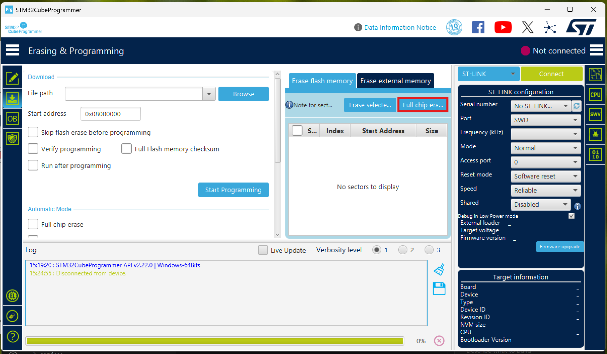

# 공장 초기화
1. STM32CubeProgrammer 실행
2. BESC 연결하고
3. 우측 상단의 **Connect** 누르면 중앙에 data 값이 뜬다.[alt text](image-1.png)
4. 좌측 목록 중 두번째 **Erasing&Programming** 클릭
5. 가운데 **Full chip erase** 클릭 하고 **OK** 
6. 다시 좌측 목록 중 첫번째 **Memory&File editing** 가보면 모든 데이터 값이 F로 초기화됨
7. 우측 상단의 **Disconnect**

# 펌웨어
**Core/Src/position_controller_.c**
>controller->gear_ratio = 1.0f;

아래 코드로 수정하고 저장

>controller->gear_ratio = POSITION_CONTROLLER_GEAR_RATIO;
---
**Core/Inc/motor_controller_conf.h**
>#define MOTOR_PHASE_ORDER -> +1 로 수정
>#define POSITION_CONTROLLER_GEAR_RATIO -> -15.0f  MOTOR_PHASE_ORDER 밑에 새 항목 입력.
---
**Core/Src/main.c**

대기

## Step 1
1. **DEVICE_CAN_ID** 번호 수정
2. **FIRST_TIME_BOOTUP** 1
3. **LOAD_ID_FROM_FLASH** 1
4. **LOAD_CONFIG_FROM_FLASH** 1
5. **LOAD_CALIBRATION_FROM_FLASH** 1
6. 모터 종류에 맞게 **MOTORPROFILE_MAD_M6C12_150KV** 또는 **MOTORPROFILE_MAD_5010_110KV** 주석 해제
7. 만약 CAN_ID 13 또는 14라면
main.c
에서 **GPIO_PIN_RESET** -> **GPIO_PIN_SET**으로 변경.
만약 아니라면 반대로 변경
7. **Run**

## Step 2
1. USB 뽑았다 꽂고
2. **FIRST_TIME_BOOTUP** 0
3. **LOAD_ID_FROM_FLASH** 0
4. **LOAD_CONFIG_FROM_FLASH** 0
5. **LOAD_CALIBRATION_FROM_FLASH** 0
6. **Run**

## Step 3
1. USB 뽑았다 꽂고
2. (**FIRST_TIME_BOOTUP** 0)
3. **LOAD_ID_FROM_FLASH** 1
4. **LOAD_CONFIG_FROM_FLASH** 1
5. **LOAD_CALIBRATION_FROM_FLASH** 1
6. **Run**

# New Flash by #jonnyspaceman
https://discord.com/channels/1363003634031530134/1363003634723586151/1405781711492481107  
So steps for anyone that wants to know:
1. Set device CAN number to what is your actuator  
Set first time boot up to 0  
Set load id from flash to 0  
Set load config from flash to 0  
Set load calibration from flash to 0  
2. Run and deploy this.  
3. Now run the calibrate_electrical_offset.py script  
4. Then go back to CUBEide and change the values to:  
set load config from flash to 1  
Set load calibration from flash to 1  
5. Run and Deploy.  
6. Then run the move actuator script and it will work.  

**I kept load_id_from_flash to 0**